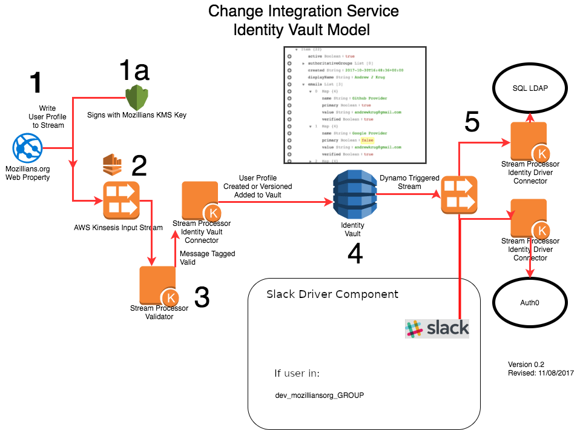

# Slack Driver

## About
This driver was created for the Mozilla IAM Project to satisfy an OKR around Slack user session expiration.

## Behavior

1. Spin up on cron/event trigger.
2. Scan the dynamodb table of all profiles.
3. Build a group data structure from all profiles.
4. Query the Slack API for all users profiles.
5. Fetch `apps.yml` access control file.
6. Disable any user without access to Slack through a Slack API call.
7. Enable any previously-disabled user that is still present in Slack database.


NOTE: If you have Slack owners (not admins), these cannot be deactivated. It is recommended to create service-accounts
for Slack owners, instead of using a normal / every-day user account. This is safer and cleaner, and you also will not
run into this issue that way since the owner accounts being service-accounts, will not need to be deactivated.

## Process Diagram


## Deployment

### Insert credstash api key

You only need to do this once.

```
credstash -r us-west-2 put -a slack-driver.token @slack-driver-api-key.txt app=slack-driver
```

To obtain the token, see <https://api.slack.com/scim> - TLDR:

1. Create an app at <https://api.slack.com/apps/new>
2. Click "set permissions" and add scope `admin`
3. Click "install app to workspace" and authorize at the prompt
4. Copy the "oauth access token" and keep it safe. That is your token for this program.


Note that you may restrict which IP ranges can call the API with this token in Slack's app settings as well.

### Deploy, test, etc

1. `cd slack_driver`
2. `make` for a list of targets, ex:

- `make install-sls` if you don't have the serverless framework installed
- `make python-venv` if you don't have your own virtual environment scripts

- `make tests` runs all tests
- `make deploy-dev` deploys the code in the dev environment
- `make remove-deploy-dev` deletes the dev deployment
- `make deploy-prod` deploys the code in the prod environment
